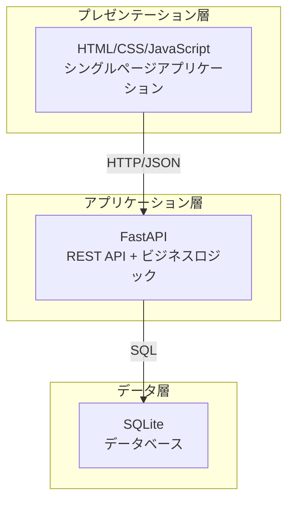
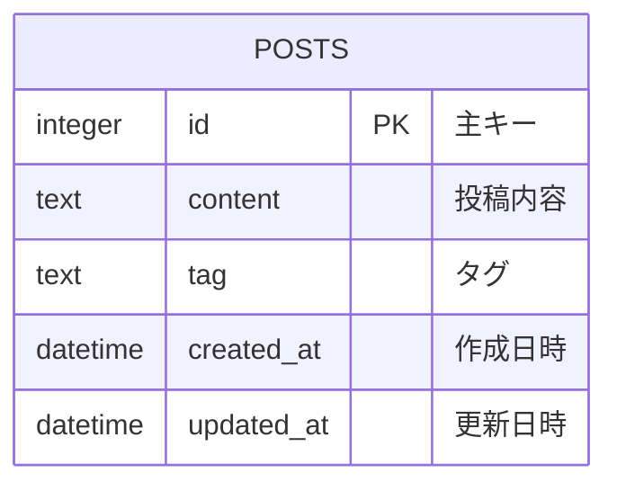
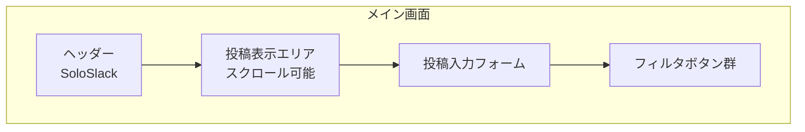

# SoloSlack - 一人用チャットツール 基本設計書

## 1. 概要

### 1.1 設計書の目的
この基本設計書は、SoloSlackのMVP版における技術的な実装方針と詳細設計を定義する。

### 1.2 設計方針
- **シンプル性**: 一人用のため、複雑な認証や権限管理は不要
- **軽量性**: 最小限の機能で高速な動作を実現
- **拡張性**: 将来の機能追加を考慮した設計
- **保守性**: 理解しやすく、修正しやすいコード構造

---

## 2. アーキテクチャ設計

### 2.1 全体アーキテクチャ



### 2.2 ディレクトリ構造

```
SoloSlack/
├── app/
│   ├── __init__.py
│   ├── main.py              # FastAPIアプリケーション
│   ├── models/
│   │   ├── __init__.py
│   │   └── post.py          # データベースモデル
│   ├── api/
│   │   ├── __init__.py
│   │   └── posts.py         # APIエンドポイント
│   ├── database/
│   │   ├── __init__.py
│   │   ├── database.py      # データベース接続
│   │   └── init_db.py       # データベース初期化
│   ├── static/
│   │   ├── css/
│   │   │   └── style.css    # スタイルシート
│   │   └── js/
│   │       └── app.js       # フロントエンドJavaScript
│   └── templates/
│       └── index.html       # メインHTMLテンプレート
├── database/
│   └── soloslack.db         # SQLiteデータベースファイル
├── requirements.txt         # Python依存関係
├── Dockerfile              # Docker設定
├── docker-compose.yml      # Docker Compose設定
└── README.md               # プロジェクト概要
```

---

## 3. データベース設計

### 3.1 ER図



### 3.2 テーブル定義

#### posts テーブル

| カラム名 | データ型 | 制約 | 説明 |
|---------|---------|------|------|
| id | INTEGER | PRIMARY KEY AUTOINCREMENT | 投稿ID |
| content | TEXT | NOT NULL | 投稿内容 |
| tag | TEXT | NULL | タグ |
| created_at | DATETIME | NOT NULL DEFAULT CURRENT_TIMESTAMP | 作成日時 |
| updated_at | DATETIME | NOT NULL DEFAULT CURRENT_TIMESTAMP | 更新日時 |

### 3.3 インデックス設計

```sql
-- タグによる検索を高速化
CREATE INDEX idx_posts_tag ON posts(tag);

-- 作成日時による並び替えを高速化
CREATE INDEX idx_posts_created_at ON posts(created_at DESC);
```

---

## 4. API設計

### 4.1 API概要

| メソッド | エンドポイント | 説明 |
|---------|---------------|------|
| GET | `/` | メインページ表示 |
| GET | `/api/posts` | 投稿一覧取得 |
| POST | `/api/posts` | 新規投稿作成 |
| GET | `/api/posts?tag={tag}` | タグによる投稿フィルタ |

### 4.2 リクエスト/レスポンス定義

#### 投稿一覧取得 (GET /api/posts)

**リクエスト**
```
GET /api/posts?tag=work&limit=50
```

**レスポンス**
```json
{
  "posts": [
    {
      "id": 1,
      "content": "今日の進捗について",
      "tag": "work",
      "created_at": "2024-12-01T10:00:00Z"
    }
  ],
  "total": 100
}
```

#### 新規投稿作成 (POST /api/posts)

**リクエスト**
```json
{
  "content": "新しいアイデアについて",
  "tag": "idea"
}
```

**レスポンス**
```json
{
  "id": 2,
  "content": "新しいアイデアについて",
  "tag": "idea",
  "created_at": "2024-12-01T11:00:00Z"
}
```

### 4.3 エラーハンドリング

| HTTPステータス | エラーコード | 説明 |
|---------------|-------------|------|
| 400 | BAD_REQUEST | リクエストパラメータが不正 |
| 404 | NOT_FOUND | リソースが見つからない |
| 500 | INTERNAL_SERVER_ERROR | サーバー内部エラー |

---

## 5. フロントエンド設計

### 5.1 画面構成



### 5.2 コンポーネント設計

#### 投稿表示コンポーネント
- **機能**: 投稿一覧の表示、スクロール、フィルタリング
- **更新**: 新規投稿時に自動更新
- **スタイル**: カード形式、タイムスタンプ表示

#### 投稿入力コンポーネント
- **機能**: 内容、タグの入力、送信（名前入力欄は廃止）
- **バリデーション**: 必須項目チェック、文字数制限
- **UX**: 送信後のフォームクリア、送信ボタンの無効化

#### フィルタコンポーネント
- **機能**: タグによる絞り込み、全表示
- **状態管理**: 現在選択中のタグの表示
- **UX**: ボタンのアクティブ状態表示

### 5.3 JavaScript設計

#### 主要な関数

```javascript
// 投稿一覧取得
async function loadPosts(tag = null) {
    const url = tag ? `/api/posts?tag=${tag}` : '/api/posts';
    const response = await fetch(url);
    const data = await response.json();
    renderPosts(data.posts);
}

// 投稿送信
async function submitPost(formData) {
    const response = await fetch('/api/posts', {
        method: 'POST',
        headers: { 'Content-Type': 'application/json' },
        body: JSON.stringify(formData)
    });
    if (response.ok) {
        loadPosts(); // 一覧更新
        clearForm(); // フォームクリア
    }
}

// フィルタ適用
function applyFilter(tag) {
    loadPosts(tag);
    updateFilterButtons(tag);
}
```

---

## 6. セキュリティ設計

### 6.1 セキュリティ要件
- **ローカル実行**: 外部からのアクセスを制限
- **入力検証**: XSS対策、SQLインジェクション対策
- **データ保護**: ローカルファイルの適切な権限設定

### 6.2 実装方針
- FastAPIのPydanticによる自動バリデーション
- SQLAlchemyのパラメータ化クエリ
- HTMLエスケープ処理
- ファイルアップロード制限（将来拡張時）

---

## 7. パフォーマンス設計

### 7.1 パフォーマンス要件
- ページ読み込み: 2秒以内
- 投稿送信: 1秒以内
- 投稿一覧表示: 1000件でも3秒以内

### 7.2 最適化方針
- **データベース**: 適切なインデックス設定
- **フロントエンド**: ページネーション、遅延読み込み
- **キャッシュ**: 静的ファイルのキャッシュ設定

---

## 8. 運用・保守設計

### 8.1 ログ設計
- **アクセスログ**: リクエスト/レスポンス記録
- **エラーログ**: 例外発生時の詳細記録
- **パフォーマンスログ**: レスポンス時間記録

### 8.2 バックアップ設計
- **データベース**: 定期的なSQLiteファイルバックアップ
- **設定ファイル**: バージョン管理による履歴管理

### 8.3 監視設計
- **ヘルスチェック**: `/health`エンドポイント
- **メトリクス**: 投稿数、アクセス数の記録

---

## 9. 開発環境設計

### 9.1 開発環境構成
- **OS**: Windows 10/11（主要開発環境）
- **Python**: 3.8以上
- **FastAPI**: 最新版
- **SQLite**: 3.x
- **Docker**: 最新版

### 9.2 開発ツール
- **IDE**: VSCode推奨
- **デバッグ**: FastAPI Debugger
- **テスト**: pytest
- **フォーマット**: black, flake8

### 9.3 Windows環境特有の考慮事項
- **PowerShell/コマンドプロンプト**: スクリプト実行環境
- **WSL**: Linux環境での開発も可能
- **Git Bash**: Unix系コマンドの使用
- **Docker Desktop**: Windows環境でのコンテナ実行

---

## 10. テスト設計

### 10.1 テスト戦略
- **単体テスト**: APIエンドポイント、データベース操作
- **統合テスト**: フロントエンド・バックエンド連携
- **E2Eテスト**: ユーザー操作フロー

### 10.2 テストケース例

#### APIテスト
```python
def test_create_post():
    response = client.post("/api/posts", json={
        "content": "テスト投稿",
        "tag": "test"
    })
    assert response.status_code == 200
    assert response.json()["content"] == "テスト投稿"
```

#### フロントエンドテスト
```javascript
test('投稿送信テスト', async () => {
    const formData = { content: 'テスト投稿', tag: 'test' };
    const result = await submitPost(formData);
    expect(result).toBeDefined();
});
```

---

**作成日**: 2025年6月
**バージョン**: 1.0
**作成者**: SoloSlack開発チーム 