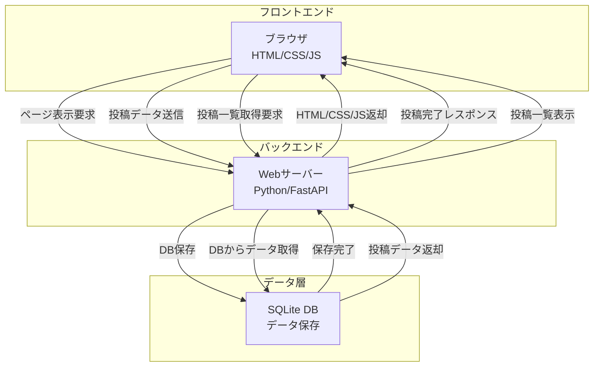
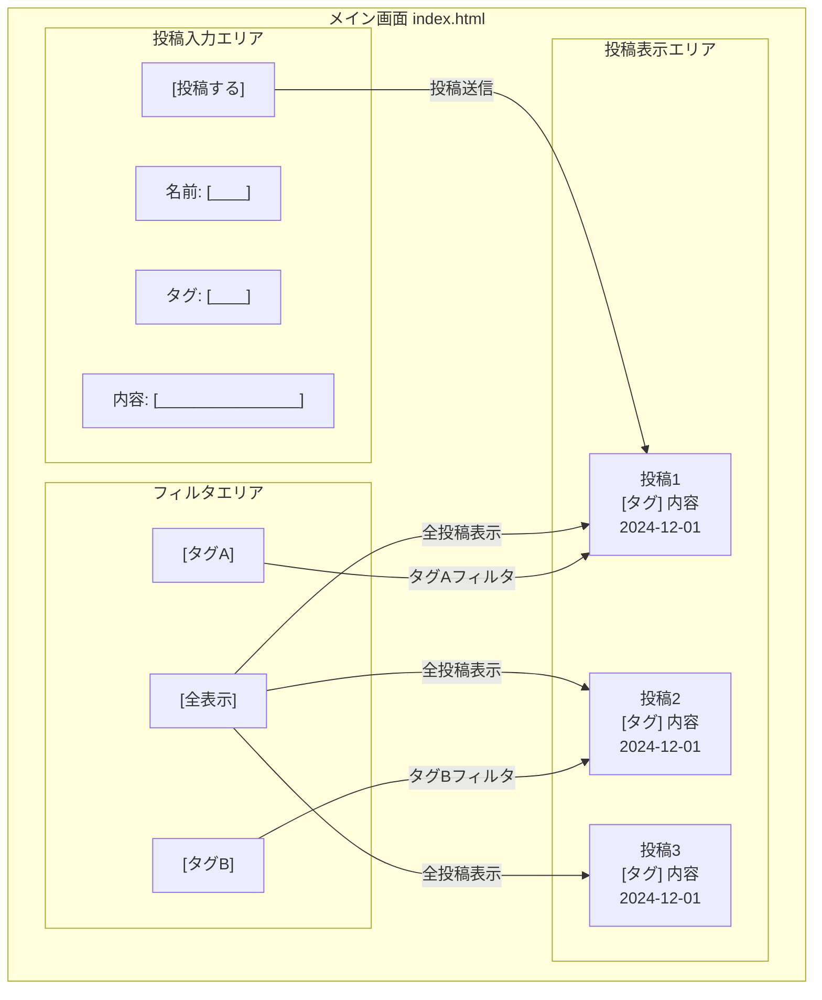

# SoloSlack - 一人用チャットツール 要件定義（MVP版）

## 1. プロジェクト概要

### 1.1 プロジェクト名

**SoloSlack** – 一人で使うSlack風チャットアプリ

### 1.2 プロジェクトの目的

* 個人開発者のための「思考ログ」兼「メモ」ツール
* チャット形式で気軽に記録できるUI
* ローカルで完結する軽量な自己対話プラットフォーム

### 1.3 技術スタック

* **バックエンド**: Python (FastAPI または Flask)
* **フロントエンド**: HTML/CSS（Vanilla JSも最低限）
* **データベース**: SQLite
* **その他**: Git / Docker

---

## 2. 機能要件（MVP）

### 2.1 基本機能

#### 2.1.1 メッセージ機能

* メッセージの送信（本文のみ）
* タイムスタンプ付きで一覧表示（新着順）
* ローカルに保存（SQLite）
* 入力画面と表示画面が同一ページ上にあるシンプルなUI

#### 2.1.2 チャンネル風タグ

* 投稿に「タグ（チャンネル名）」を付与
* タグごとにフィルタ表示可能（あくまで絞り込み）

### 2.2 その他の仕様

* シングルユーザー想定（ログイン機能なし）
* 投稿内容の編集・削除はなし（初期は追記のみ）
* ブラウザで使うローカルWebアプリ（ネット不要）

---

## 3. 非機能要件

### 3.1 パフォーマンス

* 投稿後1秒以内に反映
* 1000件程度の投稿でも閲覧に支障がないこと

### 3.2 セキュリティ

* 完全ローカル実行を前提
* データはPC内SQLiteに保存
* 外部公開・認証は対応しない（MVP段階では）

---

## 4. 技術要件

### 4.1 開発環境

* **OS**: Windows 10/11（主要開発環境）
* **Python**: 3.8以上
* **Docker**: 最新版（コンテナ化対応）
* **IDE**: VSCode推奨（設定ファイル提供予定）

### 4.2 バックエンド

* REST API（`/post`, `/list`, `/filter?tag=xxx`）
* Pydantic（FastAPI使用時）で簡単なバリデーション
* SQLite3 + SQLAlchemy or Peewee（ORM任意）

### 4.3 フロントエンド

* 単一HTML＋最低限のCSS（Bootstrapまたは自作）
* JSは送信と非同期ロードに限定（`fetch` API）
* フィルタリング機能もクライアント側で完結可

### 4.4 データベース

* 投稿テーブル（id, 名前, 本文, タグ, タイムスタンプ）
* テーブル1つに絞る（拡張余地あり）

---

## 5. システム構成図

### 5.1 コンポーネント説明

* **ブラウザ**: ユーザーインターフェース、JavaScriptによる非同期通信
* **Webサーバー**: FastAPI/FlaskによるREST API提供、ビジネスロジック処理
* **SQLite DB**: 投稿データの永続化、シンプルなテーブル構造

---

## 6. 画面遷移図

### 6.1 画面要素説明

* **投稿表示エリア**: 最新の投稿が上から表示、スクロール可能
* **投稿入力エリア**: 名前、タグ、内容を入力して投稿
* **フィルタエリア**: タグによる絞り込み表示

### 6.2 主要な操作フロー

1. **初期表示**: ページ読み込み時に全投稿を表示
2. **投稿**: 入力 → 送信 → 即座に表示エリアに反映
3. **フィルタ**: タグ選択 → 該当投稿のみ表示
4. **全表示**: フィルタ解除 → 全投稿表示

---

## 7. 制約事項

* 一人開発・一人利用を前提に、最小構成とする
* HTML/CSSもテンプレを活用し、デザイン工数をかけない
* UI/UXの高度な調整やアクセシビリティ対応は後回し

---

**作成日**: 2025年6月
**バージョン**: 0.1（MVP定義）
**作成者**: 登根 周平（SoloSlack 開発者）

.tag-button-group {
  display: flex;
  gap: 8px;
  margin-bottom: 8px;
}
.tag-btn {
  padding: 6px 16px;
  border: 2px solid #ddd;
  background: #fafafa;
  color: #333;
  border-radius: 20px;
  cursor: pointer;
  transition: all 0.2s;
}
.tag-btn.active {
  background: #4a154b;
  color: #fff;
  border-color: #4a154b;
}